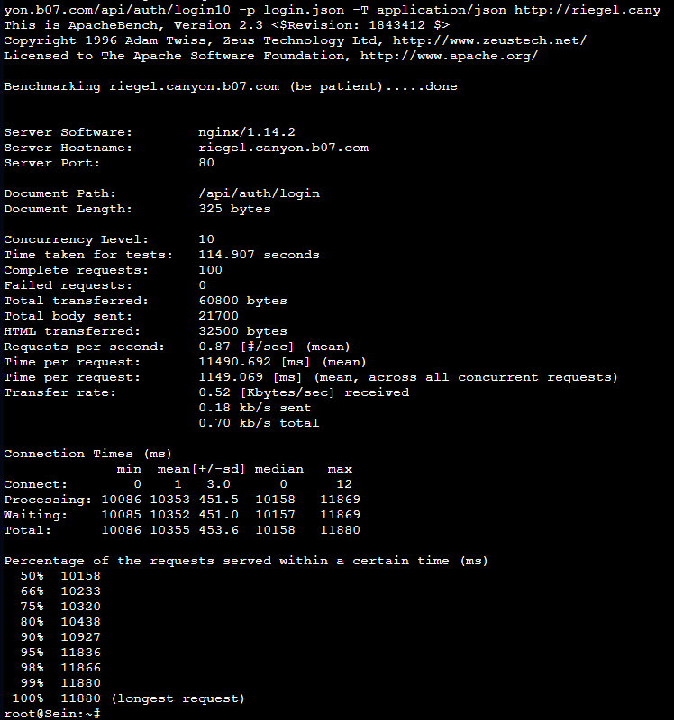
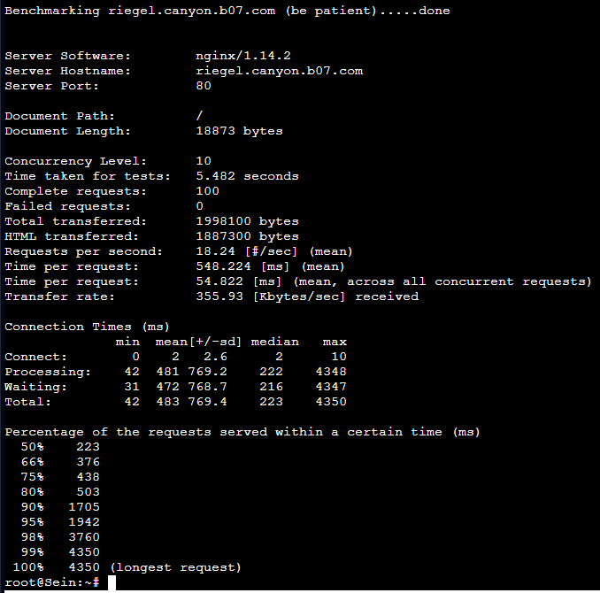

# Jarkom-Modul-3-B07-2023
> Laporan Resmi Praktikum 3 Jaringan Komputer B07
***
## Anggota Kelompok B07
1. I Gusti Ngurah Ervan Juli Ardana (5025211295)
2. Danar Sodik Priyambodo (5025211145)

## Daftar isi
+ [TOPOLOGI](#topologi)
+ [SOAL 1](#soal-1)
+ [SOAL 2](#soal-2)
+ [SOAL 3](#soal-3)
+ [SOAL 4](#soal-4)
+ [SOAL 5](#soal-5)
+ [SOAL 6](#soal-6)
+ [SOAL 7](#soal-7)
+ [SOAL 8](#soal-8)
+ [SOAL 9](#soal-9)
+ [SOAL 10](#soal-10)
+ [SOAL 11](#soal-11)
+ [SOAL 12](#soal-12)
+ [SOAL 13](#soal-13)
+ [SOAL 14](#soal-14)
+ [SOAL 15](#soal-15)
+ [SOAL 16](#soal-16)
+ [SOAL 17](#soal-17)
+ [SOAL 18](#soal-18)
+ [SOAL 19](#soal-19)
+ [SOAL 20](#soal-20)

---
## TOPOLOGI


---
## SOAL 0
### Pertanyaan
melakukan register domain berupa riegel.canyon.yyy.com untuk worker Laravel dan granz.channel.yyy.com untuk worker PHP (0) mengarah pada worker yang memiliki IP [prefix IP].x.1.
### Solusi
pada soal 0 kita diminta untuk membuat domain untuk  worker laravel berupa riegel.canyon.B07.com dan worker PHP berupa granz.channel.B07.com dan mengarah pada worker yang memiliki IP [prefix IP].x.1. Caranya yaitu kita perlu menjalankan perintah dibawah yang terdapat dalam Script.sh yang kami miliki

```
echo nameserver 192.168.122.1 > /etc/resolv.conf
apt-get update
apt-get install bind9 -y

echo '
zone "riegel.canyon.b07.com" {
        type master;
        file "/etc/bind/jarkom/riegel.canyon.b07.com";
};

zone "granz.channel.b07.com" {
        type master;
        file "/etc/bind/jarkom/granz.channel.b07.com";
};' > /etc/bind/named.conf.local

mkdir /etc/bind/jarkom
cp /etc/bind/db.local /etc/bind/jarkom/riegel.canyon.b07.com
cp /etc/bind/db.local /etc/bind/jarkom/granz.channel.b17.com

echo '
;
; BIND data file for local loopback interface
;
$TTL    604800
@       IN      SOA     riegel.canyon.b07.com. root.riegel.canyon.b07.com. (
                     2023111301         ; Serial
                         604800         ; Refresh
                          86400         ; Retry
                        2419200         ; Expire
                         604800 )       ; Negative Cache TTL
;
@       IN      NS      riegel.canyon.b07.com.
@       IN      A       10.12.4.1       ; IP Flieren
@       IN      AAAA    ::1
' > /etc/bind/jarkom/riegel.canyon.b07.com

echo '
;
; BIND data file for local loopback interface
;
$TTL    604800
@       IN      SOA     granz.channel.b07.com. root.granz.channel.b07.com. (
                     2023111302         ; Serial
                         604800         ; Refresh
                          86400         ; Retry
                        2419200         ; Expire
                         604800 )       ; Negative Cache TTL
;
@       IN      NS      granz.channel.b07.com.
@       IN      A       10.12.3.1       ; IP Lawine
@       IN      AAAA    ::1

' > /etc/bind/jarkom/granz.channel.b07.com

service bind9 restart
```
##Testing
Selanjutnya kita bisa melakukan test apakah domain tersebut sudah berjalan atau belum dengan cara melakukan ping kepada client tersebut melalui client


---
## SOAL 1
### Pertanyaan
Lakukan konfigurasi sesuai dengan peta yang sudah diberikan.
### Solusi
## Aura
```
auto eth0
iface eth0 inet dhcp

auto eth1
iface eth1 inet static
	address 10.12.1.0
	netmask 255.255.255.0

auto eth2
iface eth2 inet static
	address 10.12.2.0
	netmask 255.255.255.0

auto eth3
iface eth3 inet static
	address 10.12.3.0
	netmask 255.255.255.0

auto eth4
iface eth4 inet static
	address 10.12.4.0
	netmask 255.255.255.0
```

## Himmel
```
auto eth0
iface eth0 inet static
	address 10.12.1.1
	netmask 255.255.255.0
	gateway 10.12.1.0
```
## Heiter
```
auto eth0
iface eth0 inet static
	address 10.12.1.2
	netmask 255.255.255.0
	gateway 10.12.1.0
```
## Denken
```
auto eth0
iface eth0 inet static
	address 10.12.2.1
	netmask 255.255.255.0
	gateway 10.12.2.0
```
## Eisen
```
auto eth0
iface eth0 inet static
	address 10.12.2.2
	netmask 255.255.255.0
	gateway 10.12.2.0
```
## Lawine
```
auto eth0
iface eth0 inet static
	address 10.12.3.1
	netmask 255.255.255.0
	gateway 10.12.3.0
```
## Linie
```
auto eth0
iface eth0 inet static
	address 10.12.3.2
	netmask 255.255.255.0
	gateway 10.12.3.0
```
## Lugner
```
auto eth0
iface eth0 inet static
	address 10.12.3.3
	netmask 255.255.255.0
	gateway 10.12.3.0
```
## Frieren
```
auto eth0
iface eth0 inet static
	address 10.12.4.1
	netmask 255.255.255.0
	gateway 10.12.4.0
```
## Flamme
```
auto eth0
iface eth0 inet static
	address 10.12.4.2
	netmask 255.255.255.0
	gateway 10.12.4.0
```
## Fern
```
auto eth0
iface eth0 inet static
	address 10.12.4.3
	netmask 255.255.255.0
	gateway 10.12.4.0
```
## Semua Client (Sein, Stark, Revolte, Richter)
```
auto eth0
iface eth0 inet dhcp
```
---
## SOAL 2
### Pertanyaan
Client yang melalui Switch3 mendapatkan range IP dari [prefix IP].3.16 - [prefix IP].3.32 dan [prefix IP].3.64 - [prefix IP].3.80 
### Solusi
Pada soal kedua kita diminta untuk semua Client yang melalui Switch3 mendapatkan range IP dari [prefix IP].3.16 - [prefix IP].3.32 dan [prefix IP].3.64 - [prefix IP].3.80. Caranya yaitu kita perlu menjalankan perintah pada Script.sh yang sudah kita miliki seperti dibawah ini
```
echo '
subnet 10.12.1.0 netmask 255.255.255.0 {
}

subnet 10.12.2.0 netmask 255.255.255.0 {
}

subnet 10.12.3.0 netmask 255.255.255.0 {
    range 10.12.3.16 10.12.3.32;
    range 10.12.3.64 10.12.3.80;
    option routers 10.12.3.0;
} > /etc/dhcp/dhcpd.conf
```

---
## SOAL 3
### Pertanyaan
Client yang melalui Switch4 mendapatkan range IP dari [prefix IP].4.12 - [prefix IP].4.20 dan [prefix IP].4.160 - [prefix IP].4.168
### Solusi
pada soal ketiga kita diminta untuk semua Client yang melalui Switch4 mendapatkan range IP dari [prefix IP].4.12 - [prefix IP].4.20 dan [prefix IP].4.160 - [prefix IP].4.168. caranya kita hanya perlu menambahkan sedikit script.sh yang kita miliki
```
echo '
subnet 10.12.1.0 netmask 255.255.255.0 {
}

subnet 10.12.2.0 netmask 255.255.255.0 {
}

subnet 10.12.3.0 netmask 255.255.255.0 {
    range 10.12.3.16 10.12.3.32;
    range 10.12.3.64 10.12.3.80;
    option routers 10.12.3.0;
}
subnet 10.12.4.0 netmask 255.255.255.0 {
    range 10.12.4.12 10.12.4.20;
    range 10.12.4.160 10.12.4.168;
    option routers 10.12.4.0;
}' > /etc/dhcp/dhcpd.conf
```
---
## SOAL 4
### Pertanyaan
Client mendapatkan DNS dari Heiter dan dapat terhubung dengan internet melalui DNS tersebut
### Solusi
pada pertanyaan 4 kita diminta agar Client mendapatkan DNS dari Heiter dan dapat terhubung dengan internet melalui DNS tersebut. Caranya yaitu kita hanya perlu melengkapi sedikit konfigurasi dari no 2 dan 3 pada script.sh kita berupa
```
echo '
subnet 10.12.1.0 netmask 255.255.255.0 {
}

subnet 10.12.2.0 netmask 255.255.255.0 {
}

subnet 10.12.3.0 netmask 255.255.255.0 {
    range 10.12.3.16 10.12.3.32;
    range 10.12.3.64 10.12.3.80;
    option routers 10.12.3.0;
    option broadcast-address 10.12.3.255;
    option domain-name-servers 10.12.1.2;
    default-lease-time 180;
    max-lease-time 5760;
}

subnet 10.12.4.0 netmask 255.255.255.0 {
    range 10.12.4.12 10.12.4.20;
    range 10.12.4.160 10.12.4.168;
    option routers 10.12.4.0;
    option broadcast-address 10.12.4.255;
    option domain-name-servers 10.12.1.2;
    default-lease-time 720;
    max-lease-time 5760;
}' /etc/dhcp/dhcpd.conf
```
Kemudian agar client dapat terhubung kepada internet kita perlu melakukan DNS Forwarder dari Heiter. Caranya yaitu pada `/etc/bind/named.conf.options` Uncomment pada bagian dibawah ini
```
forwarders {
    192.168.122.1;
};
```
Kemudian comment bagian ini
```
// dnssec-validation auto;
```
Terakhir tambahkan 
```
allow-query{any;};
```
setelah melakukan semuanya kita hanya perlu melakukan restart pada bind9 lalu bisa mencoba melakukan ping pada client

## Testing


---
## SOAL 5
### Pertanyaan
Lama waktu DHCP server meminjamkan alamat IP kepada Client yang melalui Switch3 selama 3 menit sedangkan pada client yang melalui Switch4 selama 12 menit. Dengan waktu maksimal dialokasikan untuk peminjaman alamat IP selama 96 menit
### Solusi
pada soal 5 kita diminta untuk mengatur lease time dari masing masing switch. Client yang melalui Switch3 selama 3 menit sedangkan pada client yang melalui Switch4 selama 12 menit. Caranya yaitu kita hanya perlu menambahkan `default-lease-time` dan `max-lease-team` pada konfigurasi masing masing switch seperti dibawah ini
```
subnet 10.12.3.0 netmask 255.255.255.0 {
    range 10.12.3.16 10.12.3.32;
    range 10.12.3.64 10.12.3.80;
    option routers 10.12.3.0;
    option broadcast-address 10.12.3.255;
    option domain-name-servers 10.12.1.2;
    default-lease-time 180;
    max-lease-time 5760;
}

subnet 10.12.4.0 netmask 255.255.255.0 {
    range 10.12.4.12 10.12.4.20;
    range 10.12.4.160 10.12.4.168;
    option routers 10.12.4.0;
    option broadcast-address 10.12.4.255;
    option domain-name-servers 10.12.1.2;
    default-lease-time 720;
    max-lease-time 5760;
}
```
Setelah mengatur lease time dari masing masing switch kita bisa melakukan testing pada salah satu client dari masing masing switch
## Testing


---
## SOAL 6
### Pertanyaan
Pada masing-masing worker PHP, lakukan konfigurasi virtual host untuk website berikut dengan menggunakan php 7.3
### Solusi
Pertama tama kita perlu melakukan download konfigurasi yang telah diberikan menggunakan wget 
```
wget --no-check-certificate 'https://docs.google.com/uc?export=download&id=1ViSkRq7SmwZgdK64eRbr5Fm1EGCTPrU1' -O granz.channel.b07.com.zip 
unzip -o /var/www/granz.channel.b07.com -d /var/www/
```
Kemudian Pada masing-masing worker PHP, lakukan konfigurasi virtual host berikut seperti dibawah ini
```
apt-get update
apt install nginx php php-fpm -y
apt-get install wget -y
apt-get install unzip -y
apt-get install htop -y
apt-get install lynx -y
service php7.3-fpm start
php -v
service nginx start
mkdir /var/www/jarkom
cp -v -r /root/modul-3/* /var/www/jarkom/
touch /etc/nginx/sites-available/jarkom

echo '
server {

        listen 80;

        root /var/www/jarkom;

        index index.php index.html index.htm;
        server_name 10.12.3.1;

        location / {
                        try_files $uri $uri/ /index.php?$query_string;
        }

        # pass PHP scripts to FastCGI server
        location ~ \.php$ {
            include snippets/fastcgi-php.conf;
            fastcgi_pass unix:/var/run/php/php7.3-fpm.sock;
    }

    location ~ /\.ht {
                        deny all;
        }

        error_log /var/log/nginx/jarkom_error.log;
        access_log /var/log/nginx/jarkom_access.log;
}' > /etc/nginx/sites-available/jarkom

ln -s /etc/nginx/sites-available/jarkom /etc/nginx/sites-enabled
rm -rf /etc/nginx/sites-enabled/default
service php7.3-fpm restart
service nginx restart
```
## Testing
Kita dapat melakukan testing dengan melakukan `lynx localhost`


---
## SOAL 7
### Pertanyaan
Kepala suku dari Bredt Region memberikan resource server sebagai berikut:
Lawine, 4GB, 2vCPU, dan 80 GB SSD.
Linie, 2GB, 2vCPU, dan 50 GB SSD.
Lugner 1GB, 1vCPU, dan 25 GB SSD.
aturlah agar Eisen dapat bekerja dengan maksimal, lalu lakukan testing dengan 1000 request dan 100 request/second
### Solusi
Pertama tama kita perlu mengarahkan kembali kedua domain tersebut menuju ip Load Balancer (Eisen) pada DNS Server (Heiter)
```
echo '
;
; BIND data file for local loopback interface
;
$TTL    604800
@       IN      SOA     granz.channel.b07.com. root.granz.channel.b07.com. (
                     2023111302         ; Serial
                         604800         ; Refresh
                          86400         ; Retry
                        2419200         ; Expire
                         604800 )       ; Negative Cache TTL
;
@       IN      NS      granz.channel.b07.com.
@       IN      A       10.12.2.2       ; IP Eisen
@       IN      AAAA    ::1

' > /etc/bind/jarkom/granz.channel.b07.com

echo '
;
; BIND data file for local loopback interface
;
$TTL    604800
@       IN      SOA     riegel.canyon.b07.com. root.riegel.canyon.b07.com. (
                     2023111301         ; Serial
                         604800         ; Refresh
                          86400         ; Retry
                        2419200         ; Expire
                         604800 )       ; Negative Cache TTL
;
@       IN      NS      riegel.canyon.b07.com.
@       IN      A       10.12.2.2       ; IP Eisen
@       IN      AAAA    ::1

' > /etc/bind/jarkom/riegel.canyon.b07.com

service bind9 restart
```
Setelah itu pada load balancer kita perlu menambahkan sedikit konfigurasi
```
echo '
# Default menggunakan Round Robin
upstream myweb  {
    server 10.12.3.1; #IP Lawine
    server 10.12.3.2; #IP Linie
    server 10.12.3.3; #IP Lugnar
}

server {
    listen 80;
    server_name granz.channel.b07.com;

    location / {
    proxy_pass http://myweb;
    }
}' > /etc/nginx/sites-available/lb-jarkom-php

service nginx restart
```
## Testing
setelah itu kita bisa melakukan testing dari salah satu client menggunakan
```
ab -n 1000 -c 100 granz.channel.b07.com/ 
```


---
## SOAL 8
### Pertanyaan
Karena diminta untuk menuliskan grimoire, buatlah analisis hasil testing dengan 200 request dan 10 request/second masing-masing algoritma Load Balancer dengan ketentuan sebagai berikut:
Nama Algoritma Load Balancer
Report hasil testing pada Apache Benchmark
Grafik request per second untuk masing masing algoritma. 
Analisis (8)
### Solusi
caranya kita hanya perlu menjalankan 
```
ab -n 200 -c 10 granz.channel.b07.com/ 
```
#Testing
## Round Robin


## Least-connection


## IP Hash


## Generic Hash


## Grafik


## Analisis
Berdasarkan data yang disediakan, empat algoritma penjadwalan—Round Robin, Least Connection, IP Hash, dan Generic Hash—telah dibandingkan dalam konteks pengujian dengan perintah ab -n 200 -c 10 granz.channel.b07.com/. Dalam hal kinerja request per second (RPS), Least Connection, IP Hash, dan Generic Hash menunjukkan hasil yang lebih tinggi dibandingkan Round Robin. Least Connection mencapai 680 RPS, sementara IP Hash dan Generic Hash masing-masing mencapai 707 RPS dan 716 RPS.

Penggunaan CPU pada masing-masing worker juga memberikan wawasan penting. Round Robin menunjukkan distribusi yang merata pada ketiga worker-nya. Least Connection memiliki sedikit lonjakan penggunaan CPU pada Worker Lugner dan Worker Linie, mungkin mencerminkan beban koneksi yang lebih tinggi pada server-server tersebut. IP Hash menunjukkan distribusi penggunaan CPU yang merata, sesuai dengan distribusi beban kerja berdasarkan alamat IP. Sementara Generic Hash, meskipun memberikan hasil RPS tertinggi, menunjukkan lonjakan penggunaan CPU pada Worker Lugner.

Dengan demikian, pemilihan algoritma tergantung pada kebutuhan dan karakteristik lingkungan. Round Robin dan Least Connection cocok untuk situasi dengan beban kerja merata atau ketika beban koneksi memainkan peran kunci. IP Hash dapat diandalkan untuk distribusi beban kerja berdasarkan alamat IP, sementara Generic Hash menonjol dalam hal RPS, meskipun perlu memperhatikan penggunaan CPU yang lebih tinggi pada salah satu worker.

---
## SOAL 9
### Pertanyaan
Dengan menggunakan algoritma Round Robin, lakukan testing dengan menggunakan 3 worker, 2 worker, dan 1 worker sebanyak 100 request dengan 10 request/second, kemudian tambahkan grafiknya pada grimoire.
### Solusi
Kita hanya perlu melakukan testing menggunakan 
```
ab -n 100 -c 10 granz.channel.b07.com
```
## 3 Worker


## 2 Worker


## 1 Worker


## Grafik


---
## SOAL 10
### Pertanyaan
Selanjutnya coba tambahkan konfigurasi autentikasi di LB dengan dengan kombinasi username: “netics” dan password: “ajkyyy”, dengan yyy merupakan kode kelompok. Terakhir simpan file “htpasswd” nya di /etc/nginx/rahasisakita/
### Solusi
Pertama tama kita perlu membuat folder rahasiakita
```
mkdir /etc/nginx/rahasisakita
echo 'ajkb07' | htpasswd -ic /etc/nginx/rahasisakita/.htpasswd netics
```
Kemudian tambahkan sedikit konfigurasi pada load balancer yang mengatur autentikasi
```
auth_basic "Administrator'\''s Area";
auth_basic_user_file /etc/nginx/rahasiakita/.htpasswd;
```
## Testing
untuk melakukan testing kita hanya perlu mengakses kembali domain
```
lynx granz.channel.b07.com
```


---
## SOAL 11
### Pertanyaan
Lalu buat untuk setiap request yang mengandung /its akan di proxy passing menuju halaman https://www.its.ac.id.

### Solusi
Kita hanya perlu melakukan konfigurasi pada `/etc/nginx/sites-available/lb-jarkom-php` pada lb dengan kode seperti berikut ini
```
upstream backend  {
server 10.12.3.1; #IP Lawine
server 10.12.3.2; #IP Linie
server 10.12.3.3; #IP Lugnar
}

server {

listen 80;

server_name granz.channel.b07.com;

        location / {
            proxy_pass http://backend;
            proxy_set_header    X-Real-IP $remote_addr;
            proxy_set_header    X-Forwarded-For $proxy_add_x_forwarded_for;
            proxy_set_header    Host $http_host;

            auth_basic "Administrator'\''s Area";
            auth_basic_user_file /etc/nginx/rahasiakita/.htpasswd;
        }

        location ~ /\.ht {
            deny all;
        }

        location /its {
            proxy_pass https://www.its.ac.id;
        }

error_log /var/log/nginx/lb_error.log;
access_log /var/log/nginx/lb_access.log;

}
```
terdapat penambahan untuk proxy_pass yang mengarah ke website its
apabila dilakukan tes menggunakan 
```
lynx granz.channel.b07.com/its
```
maka hasilnya :


---
## SOAL 12
### Pertanyaan
Selanjutnya LB ini hanya boleh diakses oleh client dengan IP [Prefix IP].3.69, [Prefix IP].3.70, [Prefix IP].4.167, dan [Prefix IP].4.168

### Solusi
kita juga melakukan perubahan pada lb untuk soal ini, dengan perubahan ini maka akan dapat dilakukan akses untuk ip yang sudah ditentukan dengan melakukan perubahan pada `/etc/nginx/sites-available/lb-jarkom-php`
berikut merupakan hasil kodenya:
```
upstream backend  {
server 10.12.3.1; #IP Lawine
server 10.12.3.2; #IP Linie
server 10.12.3.3; #IP Lugnar
}

server {

listen 80;

server_name granz.channel.b07.com;

        location / {
            allow       10.12.3.69;
            allow       10.12.3.70;
            allow       10.12.4.167;
            allow       10.12.4.178;
            deny        all;

            proxy_pass http://backend;
            proxy_set_header    X-Real-IP $remote_addr;
            proxy_set_header    X-Forwarded-For $proxy_add_x_forwarded_for;
            proxy_set_header    Host $http_host;

            auth_basic "Administrator'\''s Area";
            auth_basic_user_file /etc/nginx/rahasiakita/.htpasswd;
        }

        location ~ /\.ht {
            deny all;
        }

        location /its {
            proxy_pass https://www.its.ac.id;
        }

error_log /var/log/nginx/lb_error.log;
access_log /var/log/nginx/lb_access.log;
}
```
untuk melakukan pengetes an kita akan mencoba 2 kali, dengan ip yang tidak sesuai dan juga 1 lagi, kita melakukan perubahan sedikit pada kode, kita melihat ip salah satu client kemudian menambahkan `allow 10.12.4.12;` hanya untuk melakukan pengetes an, berikut hasil dari ip yang salah dan ip yang sesuai.
- ip salah

- ip benar


---
## SOAL 13
### Pertanyaan
Semua data yang diperlukan, diatur pada Denken dan harus dapat diakses oleh Frieren, Flamme, dan Fern.

### Solusi
pada soal ini kami melakukan setup database pada `denken` untuk bisa menjalankan database yang di akses ketiga worker laravel, berikut langkahnya
```
apt-get update
apt-get install mariadb-server -y
service mysql start
```
kemudian membuat username password dan database untuk bisa di akses di ketiga worker dengan membuka mysql terlebih dahulu
```
mysql
```
kemudian
```
CREATE USER 'kelompokb07'@'%' IDENTIFIED BY 'passwordb07';
CREATE USER 'kelompokb07'@'localhost' IDENTIFIED BY 'passwordb07';
CREATE DATABASE dbkelompokb07;
GRANT ALL PRIVILEGES ON *.* TO 'kelompokb07'@'%';
GRANT ALL PRIVILEGES ON *.* TO 'kelompokb07'@'localhost';
FLUSH PRIVILEGES;
```
keluar dari mysql dengan `\q`

langkah selanjutnya adalah dengan menambahkan konfigurasi pada `/etc/mysql/my.cnf`
dengan mengisikan sebagai berikut
```
[client-server]

# Import all .cnf files from configuration directory
!includedir /etc/mysql/conf.d/
!includedir /etc/mysql/mariadb.conf.d/

[mysqld]
skip-networking=0
skip-bind-address
```
restart mysql
```
service mysql restart
```

lakukan testing pada ketiga worker laravel apakah sudah bisa melakukan akses ke database yang sudah di set di denken, namun harus melakukan install terlebih dahulu mariadb pada worker laravel
```
apt-get update
apt-get install mariadb-client -y
```
dan akses database dengan command berikut
```
mariadb --host=10.12.2.1 --port=3306 --user=kelompokb07 --password=passwordb07
```
kemudian apabila sudah terhubung maka akses database dengan menampilkan database yang sudah terbuat, apakah database yang dibuat di denken sudah bisa di akses. berikut hasilnya


---
## SOAL 14
### Pertanyaan
Frieren, Flamme, dan Fern memiliki Riegel Channel sesuai dengan quest guide berikut. Jangan lupa melakukan instalasi PHP8.0 dan Composer

### Solusi
kami melakukan instalasi laravel dan melakukan deploy pada ketiga worker laravel dengan beberapa langkah berikut
```
apt-get install -y lsb-release ca-certificates apt-transport-https software-properties-common gnupg2
curl -sSLo /usr/share/keyrings/deb.sury.org-php.gpg https://packages.sury.org/php/apt.gpg
sh -c 'echo "deb [signed-by=/usr/share/keyrings/deb.sury.org-php.gpg] https://packages.sury.org/php/ $(lsb_release -sc) main" > /etc/apt/sources.list.d/php.list'
apt-get update
apt-get install php8.0-mbstring php8.0-xml php8.0-cli php8.0-common php8.0-intl php8.0-opcache php8.0-readline php8.0-mysql php8.0-fpm php8.0-curl unzip wget -y
apt-get install nginx -y
```
setelah melakukan instalasi untuk php8.0, kita juga melakukan instalasi composer dengan command berikut
```
wget https://getcomposer.org/download/2.0.13/composer.phar
chmod +x composer.phar
mv composer.phar /usr/bin/composer
```
kemudian melakukan instalasi git dan melakukan clone dari github laravel praktikum yang sudah disediakan
```
apt-get install git -y
cd /var/www
git clone https://github.com/martuafernando/laravel-praktikum-jarkom.git
cd laravel-praktikum-jarkom
composer update
composer install
```
lakukan edit pada .env dengan copy atau rename dari `.env.example` ke `.env`
```
cp .env.example .env
```
edit pada file .env tersebut seperti berikut
```
APP_NAME=Laravel
APP_ENV=local
APP_KEY=base64:FMAdHCoIH+DQ7mcVuaRd31G8ZvitSNWM/MIsehhilE0=
APP_DEBUG=true
APP_URL=http://localhost

LOG_CHANNEL=stack
LOG_DEPRECATIONS_CHANNEL=null
LOG_LEVEL=debug

DB_CONNECTION=mysql
DB_HOST=10.12.2.1
DB_PORT=3306
DB_DATABASE=dbkelompokb07
DB_USERNAME=kelompokb07
DB_PASSWORD=passwordb07

BROADCAST_DRIVER=log
CACHE_DRIVER=file
FILESYSTEM_DISK=local
QUEUE_CONNECTION=sync
SESSION_DRIVER=file
SESSION_LIFETIME=120

MEMCACHED_HOST=127.0.0.1

REDIS_HOST=127.0.0.1
REDIS_PASSWORD=null
REDIS_PORT=6379

MAIL_MAILER=smtp
MAIL_HOST=mailpit
MAIL_PORT=1025
MAIL_USERNAME=null
MAIL_PASSWORD=null
MAIL_ENCRYPTION=null
MAIL_FROM_ADDRESS="hello@example.com"
MAIL_FROM_NAME="${APP_NAME}"

AWS_ACCESS_KEY_ID=
AWS_SECRET_ACCESS_KEY=
AWS_DEFAULT_REGION=us-east-1
AWS_BUCKET=
AWS_USE_PATH_STYLE_ENDPOINT=false

PUSHER_APP_ID=
PUSHER_APP_KEY=
PUSHER_APP_SECRET=
PUSHER_HOST=
PUSHER_PORT=443
PUSHER_SCHEME=https
PUSHER_APP_CLUSTER=mt1

VITE_PUSHER_APP_KEY="${PUSHER_APP_KEY}"
VITE_PUSHER_HOST="${PUSHER_HOST}"
VITE_PUSHER_PORT="${PUSHER_PORT}"
VITE_PUSHER_SCHEME="${PUSHER_SCHEME}"
VITE_PUSHER_APP_CLUSTER="${PUSHER_APP_CLUSTER}"
```
menyesuaikan dengan database kelompok.
kemudian kita harus menjalankan beberapa command artisan untuk melakukan deploy
```
php artisan migrate:fresh
php artisan db:seed --class=AiringsTableSeeder
php artisan key:generate
php artisan config:cache
php artisan storage:link
php artisan jwt:secret
php artisan config:clear
chown -R www-data.www-data /var/www/laravel-praktikum-jarkom/storage
```
kemudian membuat file pada nginx untuk dapat di akses, buat file dengan
```
touch /etc/nginx/sites-available/riegel.canyon.b07.com
```
kemudian isikan seperti berikut
```
server {

    listen 80;

    root /var/www/laravel-praktikum-jarkom/public;

    index index.php index.html index.htm;
    server_name _;

    location / {
            try_files $uri $uri/ /index.php?$query_string;
    }

    # pass PHP scripts to FastCGI server
    location ~ \.php$ {
    include snippets/fastcgi-php.conf;
    fastcgi_pass unix:/var/run/php/php8.0-fpm.sock;
    }

    location ~ /\.ht {
            deny all;
    }

    error_log /var/log/nginx/implementasi_error.log;
    access_log /var/log/nginx/implementasi_access.log;
}
```
dan terakhir jalankan
```
ln -s /etc/nginx/sites-available/riegel.canyon.b07.com /etc/nginx/sites-enabled/
service php8.0-fpm start
service nginx start
```
maka website laravel sudah dapat di akses, coba lakukan akses pada client dengan melakukan lynx
```
lynx riegel.canyon.b07.com
```
maka akan muncul tampilan berikut


---
## SOAL 15
### Pertanyaan
Riegel Channel memiliki beberapa endpoint yang harus ditesting sebanyak 100 request dengan 10 request/second. Tambahkan response dan hasil testing pada grimoire.
POST /auth/register

### Solusi
kita memerlukan file tambahan berupa json untuk melakukan registrasi pada website ini dengan membuat file `register.json` pada root client yang ingin melakukan pengetestan, dengan isi sebagai berikut
```
{
    "username": "kelompokb07",
    "password": "passwordb07"
}
```
kemudian jalankan command berikut
```
ab -n 100 -c 10 -p register.json -T application/json http://riegel.canyon.b07.com/api/auth/register
```
dan juga pantau pada worker untuk mengetahui proses tersebut sedang berjalan dengan menggunakan
```
htop
```
maka hasilnya sebagai berikut


NOTE : hanya berhasil 1 proses karena username dan password tersebut hanya di terima unique atau tidak bisa ganda dan sama.

---
## SOAL 16
### Pertanyaan
Riegel Channel memiliki beberapa endpoint yang harus ditesting sebanyak 100 request dengan 10 request/second. Tambahkan response dan hasil testing pada grimoire.
POST /auth/login

### Solusi
kita memerlukan file tambahan berupa json untuk melakukan login pada website ini dengan membuat file `login.json` pada root client yang ingin melakukan pengetestan, dengan isi sebagai berikut
```
{
    "username": "kelompokb07",
    "password": "passwordb07"
}
```
kemudian jalankan command berikut
```
ab -n 100 -c 10 -p login.json -T application/json http://riegel.canyon.b07.com/api/auth/login
```
dan juga pantau pada worker untuk mengetahui proses tersebut sedang berjalan dengan menggunakan
```
htop
```
maka hasilnya sebagai berikut



---
## SOAL 17
### Pertanyaan
Riegel Channel memiliki beberapa endpoint yang harus ditesting sebanyak 100 request dengan 10 request/second. Tambahkan response dan hasil testing pada grimoire.
GET /me

### Solusi
pada request ini sedikit berbeda, kita memerlukan token yang diambil, untuk bisa mendapatkannya maka pertama jalankan berikut
```
curl -X POST -H "Content-Type: application/json" -d @login.json http://riegel.canyon.b07.com/api/auth/login > apiLog.txt
```
kemudian jalankan untuk di set global
```
token=$(cat apiLog.txt | jq -r '.token')
```
dan lakukan request dengan
```
ab -n 100 -c 10 -H "Authorization: Bearer $token" http://riegel.canyon.b07.com/api/me
```
dan juga pantau pada worker untuk mengetahui proses tersebut sedang berjalan dengan menggunakan
```
htop
```
maka hasilnya sebagai berikut


---
## SOAL 18
### Pertanyaan
Untuk memastikan ketiganya bekerja sama secara adil untuk mengatur Riegel Channel maka implementasikan Proxy Bind pada Eisen untuk mengaitkan IP dari Frieren, Flamme, dan Fern.

### Solusi
untuk memastikan semua berjalan secara adil, kita hanya menggunakan lb, karena pada dasarnya lb atau load balancer sendiri digunakan untuk membagi rata kerja dari 3 worker laravel dengan melakukan edit konfigurasi dengan command pada `eisen` dengan
```
nano /etc/nginx/sites-available/lb-jarkom-laravel
```
kemudian ubah seperti berikut ini
```
upstream laravel {
        server 10.12.4.1:8001;
        server 10.12.4.2:8002;
        server 10.12.4.3:8003;
}

server {
        listen 80;
        server_name riegel.canyon.b07.com;

        location / {
                proxy_pass http://laravel;
        }
}
```
kemudian lakukan testing kembali dengan menggunakan client dan akan menghasilkan 3 proses pada worker dan hasil pada client, hasilnya sebagai berikut


---
## SOAL 19
### Pertanyaan
Untuk meningkatkan performa dari Worker, coba implementasikan PHP-FPM pada Frieren, Flamme, dan Fern. Untuk testing kinerja naikkan 
- pm.max_children
- pm.start_servers
- pm.min_spare_servers
- pm.max_spare_servers
sebanyak tiga percobaan dan lakukan testing sebanyak 100 request dengan 10 request/second kemudian berikan hasil analisisnya pada Grimoire.

### Solusi
untuk soal ini kita harus melakukan set pada pool dengan 
```
nano /etc/php/7.3/fpm/pool.d/www.conf
```
kemudian isikan berikut
```
[www]
user = www-data
group = www-data
listen = /run/php/php7.3-fpm.sock
listen.owner = www-data
listen.group = www-data
php_admin_value[disable_functions] = exec,passthru,shell_exec,system
php_admin_flag[allow_url_fopen] = off

; Choose how the process manager will control the number of child processes.

pm = dynamic
pm.max_children = 75
pm.start_servers = 10
pm.min_spare_servers = 5
pm.max_spare_servers = 20
```
dan restart
```
service php7.3-fpm start
service php7.3-fpm restart
service nginx restart
```
kemudian berikut merupakan hasilnya





---
## SOAL 20
### Pertanyaan
Nampaknya hanya menggunakan PHP-FPM tidak cukup untuk meningkatkan performa dari worker maka implementasikan Least-Conn pada Eisen. Untuk testing kinerja dari worker tersebut dilakukan sebanyak 100 request dengan 10 request/second.

### Solusi
kita hanya sedikit melakukan perubahan pada lb `eisen` sebagai berikut
```
nano /etc/nginx/sites-available/lb-jarkom-laravel
```
dan ditambahkan algoritma `least_conn;` berikut
```
upstream laravel {
        least_conn;
        server 10.12.4.1:8001;
        server 10.12.4.2:8002;
        server 10.12.4.3:8003;
}

server {
        listen 80;
        server_name riegel.canyon.b07.com;

        location / {
                proxy_pass http://laravel;
        }

}
```
dan lakukan restart
```
service php7.3-fpm start
service php7.3-fpm restart
service nginx restart
```
dan berikut hasil setelah dilakukan percobaan request
